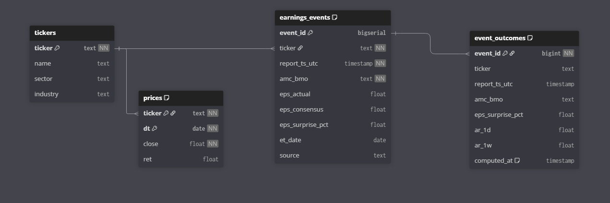

# Earnings Surprise Research Project

A comprehensive data pipeline for analyzing earnings surprises and their impact on stock prices using abnormal returns analysis.

## Overview

This project collects earnings events from multiple sources (Yahoo Finance and NASDAQ), processes stock price data, and calculates abnormal returns to measure market reactions to earnings surprises. The pipeline is designed for quantitative finance research and analysis.

## Database Schema

The project uses PostgreSQL with four main tables:



### Core Tables

1. **`tickers`** - Reference table for stock symbols
   - `ticker` (TEXT, PK) - Stock symbol
   - `name` (TEXT) - Company name
   - `sector` (TEXT) - Business sector
   - `industry` (TEXT) - Industry classification

2. **`prices`** - Daily stock price data
   - `ticker` (TEXT, FK) - Stock symbol
   - `dt` (DATE) - Trading date
   - `close` (FLOAT) - Adjusted closing price
   - `ret` (FLOAT) - Daily return (close-to-close % change)
   - **Primary Key:** `(ticker, dt)`

3. **`earnings_events`** - Earnings announcement data
   - `event_id` (BIGSERIAL, PK) - Unique event identifier
   - `ticker` (TEXT, FK) - Stock symbol
   - `report_ts_utc` (TIMESTAMP) - Earnings release timestamp (UTC)
   - `amc_bmo` (TEXT) - After Market Close / Before Market Open indicator
   - `eps_actual` (FLOAT) - Actual earnings per share
   - `eps_consensus` (FLOAT) - Consensus EPS estimate
   - `eps_surprise_pct` (FLOAT) - Earnings surprise percentage
   - `et_date` (DATE) - Eastern timezone calendar date
   - `source` (TEXT) - Data source ('yfinance' or 'nasdaq')
   - **Unique Constraint:** `(ticker, et_date)`

4. **`event_outcomes`** - Precomputed abnormal returns
   - `event_id` (BIGINT, PK, FK) - Links to earnings_events
   - `ticker` (TEXT) - Stock symbol (denormalized)
   - `report_ts_utc` (TIMESTAMP) - Event timestamp (denormalized)
   - `amc_bmo` (TEXT) - Timing indicator (denormalized)
   - `eps_surprise_pct` (FLOAT) - Surprise percentage (denormalized)
   - `ar_1d` (FLOAT) - 1-day abnormal return
   - `ar_3d` (FLOAT) - 3-day cumulative abnormal return
   - `ar_1w` (FLOAT) - 1-week (5-day) cumulative abnormal return
   - `computed_at` (TIMESTAMP) - Calculation timestamp

### Relationships
- `prices.ticker` → `tickers.ticker`
- `earnings_events.ticker` → `tickers.ticker`
- `event_outcomes.event_id` → `earnings_events.event_id`

## Project Structure

```
.
├── data/                    # Processed CSV files
│   ├── events.csv          # Merged earnings events
│   ├── nasdaq_events.csv   # Raw NASDAQ earnings data
│   ├── yf_events.csv       # Raw Yahoo Finance earnings data
│   └── prices.csv          # Processed stock prices
├── raw_prices/             # Raw price CSV files per ticker
├── sql/migrations/         # Database schema migrations
├── earnings_pipline/       # Python data pipeline
│   ├── config.py          # Configuration and constants
│   ├── util.py            # Utility functions
│   ├── fetch_prices.py    # Price data processing
│   ├── fetch_nasdaq.py    # NASDAQ earnings data fetcher
│   ├── fetch_yfinance.py  # Yahoo Finance earnings fetcher
│   ├── merge_events.py    # Merge earnings from multiple sources
│   ├── load_tickers.py    # Ticker metadata enrichment
│   └── compute_outcomes.py # Abnormal returns calculation
├── Makefile               # Automation commands
└── README.md             # This file
```

## Setup

### Prerequisites
- Docker (for PostgreSQL)
- Python 3.8+
- Required Python packages: `pandas`, `yfinance`, `psycopg2`, `pytz`, `requests`

### Database Setup

1. **Start PostgreSQL container:**
   ```bash
   make postgres
   ```

2. **Create database:**
   ```bash
   make createdb
   ```

3. **Run migrations:**
   ```bash
   make migrateup
   ```

## Usage

### Data Pipeline Commands

The project provides a comprehensive Makefile with the following commands:

#### Database Management
```bash
make postgres          # Start PostgreSQL container
make start_postgres    # Start existing container
make stop_postgres     # Stop and remove container
make createdb          # Create database
make migrateup         # Run pending migrations
make migratedown       # Rollback last migration
```

#### Data Fetching
```bash
make fetch-prices      # Process raw price files into prices.csv
make fetch-nasdaq      # Fetch earnings from NASDAQ API
make fetch-yfinance    # Fetch earnings from Yahoo Finance API
make merge-events      # Merge earnings from multiple sources
make load-tickers      # Enrich ticker metadata
```

#### Data Loading
```bash
make upsert-prices     # Load prices.csv into database
make upsert-events     # Load events.csv into database
make compute-outcomes  # Calculate abnormal returns
```

#### Utility
```bash
make help             # Show all available commands
```

### Typical Workflow

1. **Data Collection:**
   ```bash
   make fetch-nasdaq      # Get NASDAQ earnings data
   make fetch-yfinance    # Get Yahoo Finance earnings data
   make merge-events      # Combine and deduplicate
   make fetch-prices      # Process stock price data
   ```

2. **Database Loading:**
   ```bash
   make load-tickers      # Load ticker metadata
   make upsert-prices     # Load price data
   make upsert-events     # Load earnings events
   ```

3. **Analysis:**
   ```bash
   make compute-outcomes  # Calculate abnormal returns
   ```

## Key Features

### Data Sources
- **NASDAQ API**: Earnings surprise data with precise timing
- **Yahoo Finance**: Comprehensive earnings calendar and stock prices
- **Multiple ticker support**: Configurable stock universe

### Abnormal Returns Calculation
- **Market benchmark**: Uses SPY (S&P 500 ETF) as market proxy
- **Time windows**: 1-day, 3-day, and 1-week abnormal returns
- **Precise timing**: Accounts for AMC/BMO timing for event day calculation
- **Missing data handling**: Robust handling of trading holidays and data gaps

### Data Quality
- **Deduplication**: Events deduplicated by ticker and Eastern timezone date
- **Source tracking**: Each event tagged with data source
- **Timezone handling**: Proper UTC storage with Eastern timezone logic
- **Data validation**: Type checking and constraint enforcement

## Configuration

### Database Settings
- **Host**: localhost:1515
- **Database**: eqr
- **User**: root
- **Password**: password

### Pipeline Settings
- **Ticker universe**: Configurable in `earnings_pipline/config.py`
- **Yahoo Finance limit**: 24 quarters of earnings history per ticker
- **Data directories**: `data/` for processed files, `raw_prices/` for raw data

## Development

### Adding New Tickers
Modify the ticker list in `earnings_pipline/util.py` in the `get_all_tickers()` function.

### Creating New Migrations
```bash
make newmigration name=your_migration_name
```

### Database Maintenance
The system uses staging tables for safe upserts and handles conflicts gracefully. All data loading operations are atomic and can be re-run safely.

## Research Applications

This pipeline supports various quantitative finance research:

- **Earnings surprise impact analysis**
- **Market efficiency studies**
- **Event study methodology**
- **Cross-sectional abnormal returns analysis**
- **Temporal patterns in earnings reactions**

The precomputed `event_outcomes` table enables fast querying for analysis and visualization while maintaining links to the underlying detailed data.